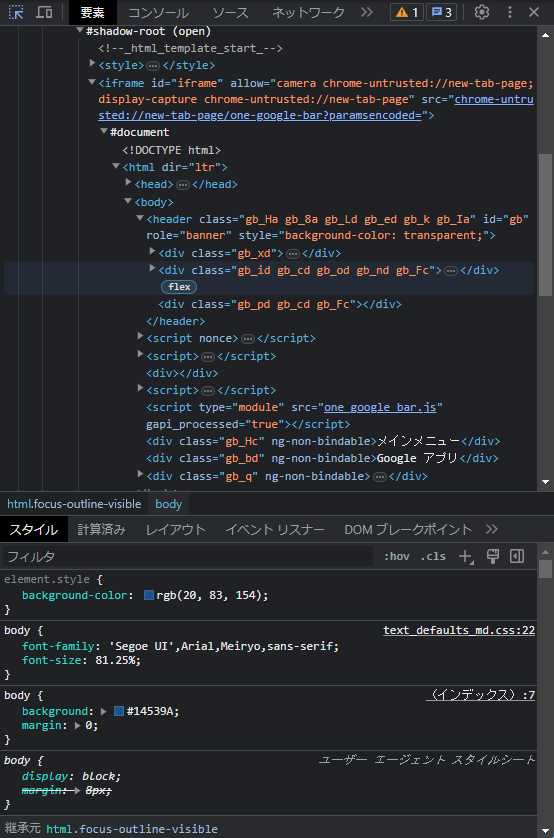

# 初めに
この文書はとりあえず作って見たというだけの、あまり参考にならないかもしれない**JavaScriptを書くためだけ**の文書です。(公開したらこの行は消す。僕のためのメモ)  

これを読めば、ある程度**JavaScriptを書くこと**が**詳しくなります！**しかも、**簡単に**。  
更に、この記事で行う行為は**すべて無料**です！！さあ、詐欺感が増しましたね。ドキドキしながら行っていきましょう。  
ちなみに、説明中に全く同じ解説が2回以上行われることがありますが、それは**何度も復習**することで**覚えてもらうため**ですので、ご了承ください。

ちなみにこの記事は、JavaScriptが**書けるように**なるまでを**サポート**するための記事であるため、JavaScriptが**何か**、**どうして使うのか**、**利点や欠点**については**詳しく解説していません**。それらを知る場合は、別途「**JavaScript とは**」などを**検索する**と、良い記事を見つけることが出来ます。

この記事は2023年中旬に書かれました。

# JavaScriptとは
簡潔に言ってしまえば、**ブラウザで動くプログラム**です。他には**工夫**さえすれば**PC上**でアプリとしても動きます。  
この話題についてはかなり深いため、あなたにはこの文書を読んでもらい、じっくり、ゆっくりと理解してもらいます。

ちなみに、JavaScriptは**上級者**なら**メモ帳**でも書くことが出来ますが、それはあくまでも**カッコつけ**ですので、**サポート機能**が付いた、**プログラマ**や**上級者**にも愛されている**Visual Studio Code**というものを主に使って作成していきます。後々紹介します。

JavaScriptでプログラムを書くことも立派な**開発**です。なので、**準備**しないといけないものがあります。それらをこれから紹介していきます。

# 準備
JavaScriptで開発するだけなら**パソコン**は**何でも**構いません。「**Visual Studio Code**」という**アプリ**が入るパソコンであれば、**何でも**いいのです。  
とりあえず**macとか**買っておけばいいです。Windowsパソコンがあればそれでもいいです。  
次にアプリをパソコンに入れていきましょう。あなたは**アプリを入れる方法**を**既に知っている**という体で話していくため、わからない場合は「[**アプリのインストール**](#アプリのインストール)」という解説をご覧ください。  
## 入れるアプリ
- **Node.js**(読み: のーどじぇーえす)
- **Visual Studio Code**(読み: びじゅあるすたじおこーど 略称: VSCode 略称読み: ぶいえすこーど)

この２つで終わりです。Node.jsとは、後々役立つ**実行環境**です。後々解説します。Visual Studio Code、通称**VSCode**はプログラムを「**書く**」ためのものです。使い方プログラムを書く前に必ず教えます。

## アプリのインストール
分かる方は「[VSCodeの準備・練習](#vscodeの準備・練習)」へいきましょう。わからない方向けです。

# VSCodeの準備・練習
まずは**VSCode**を**使う練習**から始めていきます。  
## 初めての起動
VSCodeを起動してください。時間が経ったらウィンドウには英語で色々表示されると思われます。 


ですが、**少し経つ**と**右下**に「Restart Now」または「今すぐ再起動」他には「Change Language and Restart」等の青いボタンが出てきます。それを押すと...気づけば日本語に！安心してついてきましょう。  
ですが、時々VSCodeは**英語のまま**になってしまうことがあります。時間が経っても出てこなかったら、「[緊急: 日本語にする方法](#緊急-日本語にする方法)」をご確認ください。

## VSCodeで「フォルダを開く」をする
フォルダを開くと、プログラムを書く上で様々な便利機能や、ミスを減らしたり、管理を楽にしたりすることが出来ます。プログラムは何十から何百ものファイルを管理しますので、覚えておきましょう。


これは記者の画面です。VSCodeは使っているとこうなるんだなとだけ思ってください。

本題に戻り、フォルダを開いてみましょう。  


上にある「ファイル」をクリックすると一覧(ペイン)が出ます。そこに「フォルダを開く...」があれば、押します。  
なければ、キーボードで同時に「Ctrl(cmd)+K」を押し、その後に「Ctrl(cmd)+O」と押します。


するとファイル選択画面が出るので、新しくフォルダで「プログラム練習」または「programTraining」と入力し、開きます。名前や場所は各自ご自由に。覚えていれば問題ありません。  

あと、ついでですが上の「ファイル」にある「自動保存」を必ず有効にすると、作業が楽です。

## ファイルを作成して、何かを書いてみる
まだプログラムは書きません。今から行うのはVSCodeの操作トレーニングです。  


左にあるバーに紙が２枚重なったアイコン「エクスプローラー」をクリックします。そこには先ほぼ入力したフォルダの名前が書かれていると思います。  


そこの下側の空白部分を右クリックすると、「新しいファイル」や「新しいフォルダ」等が出てきます。出てこない場合、間違っていますのでよく確認しましょう。 


「新しいファイル」をクリックすると、謎の枠が出てくるので、そこにテキストファイルとして「テスト.txt」と入力します。


そしてEnterを押すと、右の大きな画面の表示が変わります。そこで、あなたはプログラムを書くのです。少しテキストファイルに何か文書が書けることがわかったら、次の工程に行きましょう。

# 基礎１-１: ブラウザで開発をする準備
では、本題です。開発を始めるために、色々なことを始めていきましょう。
## ブラウザでJavaScriptを動かす練習 
とりあえず、まずはブラウザでJavaScriptを動かす練習からですね。   
あなたには「index.js」というファイルを作成してもらいます。作成出来たら次の文書をお読みください。  
そのjsファイルに次のプログラムを入れましょう。  

ちなみに、jsファイルとは拡張子「.OO」という部分から英字をもぎ取って「OOファイル」ということがあります。
```js
console.log("Hello World");
```
これで表面上はプログラムが書けています。  
しかし、これだけでは実行できません。なので、あなたにはもう一つ「index.html」ファイルを作成してもらいます。作成出来たら次の文書を読みましょう。
そのhtmlファイルに次のプログラムを入れてください。今はhtmlの解説はしません。
```html
<!DOCTYPE html>
<html>
    <head>
        <meta charset="utf-8">
        <script src="index.js"></script>
    </head>
</html>
```
これを書き、htmlファイルを立ち上げることで、ようやくプログラムが動きます。  
あなたの画面にはブラウザが表示されていますよね。(表示されていない場合は「[緊急: HTMLファイルを開く](#緊急-htmlファイルを開く)」を参考にしてください。)  
ですが、まだあなたは「Hello World」という文字を見ていません。何故でしょうか。

## コンソール画面を見るには
あなたのブラウザはEdge、Chrome、Firefox、Safariの４択だと思われます。それぞれ、Hello Worldを見る、つまりコンソール画面を見る方法方法を教えます。これがわからなかった場合、あなたはブラウザ上の開発には向かず、更にはプログラム開発が出来ない可能性まで出てきます。

では今からプラットフォーム順に方法を紹介します。
### Edgeの場合  
<br>
キーボードショートカット「Ctrl+Shift+C」で「開発者ツール」というものが開きます。そこの下側に「コンソール」というタブがあるので、そこを見るか、上側に「要素」それの横に「>>」があると思うので、それをクリックし、一覧から「コンソール」をクリックします。すると「Hello World」を見つけることが出来ます。

### Chromeの場合  
<br>
Edgeと殆ど同じです。キーボードショートカット「Ctrl+Shift+C」で「DevTools」というものが開きます。上側に「Switch DevTools to Japanese」というボタンがあれば、押して置くと役立ちます。その後再起動がかかることがあるので、少し待ったら、上に「コンソール」というボタンがあるので、クリックすることでHello Worldを見つけることが出来ます。

### FireFoxの場合  
Ubuntu(Linux)向けです。

### Safariの場合  
mac向けです。

以上の方法で、ブラウザでのJavaScript開発をする準備は出来ました。

# 基礎１-２: ログを理解する
今から行うことはNode.jsでもブラウザでも動くものです。この説明は今は意味が分からないかもしれませんが、いずれ分かります。そっと頭の隅に置いておきましょう。

では、まず先ほど書いた次のプログラムの意味を説明します。
```js
console.log();
```
これは英語にも書かれている通り、「コンソールログ」です。これはコンソールにログとして出力するもので、様々な用途に使えます。例えば
```js
console.log("これはペンです。");
```
等と書くと、コンソールに「これはペンです。」と表示されます。

さて、少し疑問を感じている方がいると、記者は感じました。疑問がない方は次へ行きましょう。

## ちょっとした疑問を解決

先ほどのプログラム。どこに書く？と思いましたよね。JavaScriptはとんでもなく簡単なので、先ほど作った`index.js`にコピペするだけでいいのです。


本当に簡単なのですが、これで動かない場合、「フォルダを開く」という行為をしていないか、ファイル名を間違えているかもしれません。よーく見ておきましょう。

# 基礎１-３: 変数を理解する
変数とは、数学において使われる変数とは別物だと思っていただいても構いません。ですが、本質的には少し似ているのではないでしょうか。知りませんけど。
```js
const hensu1 = "変数１";
let hensu2 = "変数２";
```
これは「hensu1」「hensu2」というものを作成しています。
詳しく理解してみましょう。
```js
const name = "名前";
```
これは**const(コンスト)**という方法で変数を定義し、**初期化**しました。  
初期化とは、変数を設定つまり定義した時に、即座に値を入れることです。  
上の例では「name」が**変数名**です。その隣にあるイコールの右側の「`"名前"`」のことを**値**と呼びます。

このconstには、次の機能があります。
- 殆どの場合値が書き換えられないという保証が付く  
- 動作が少し軽量化する
- 安定性がある
上の機能があると、下のような例が起きます。
```js
const name = "名前";
name = "名前2"; // エラー
```
一度変数を作ったら、その値は不動です。何か値を書き換えないと行けない場面ではないのなら、必ずconstを使いましょう。その例外がある場合、次の方法で変数を定義しましょう。
```js
let name = "名前";
```
これは**let(レット)**という方法で変数を定義し初期化しました。
これも先ほどと同様で、「name」が**変数名**、イコールの右側が**値**です。

このletには、次の機能があります。
- 他の値に書き換えることが出来る。
- 追記することが出来る(文字列の場合のみ)
上の機能があると、次のようなことが出来ます。
```js
let name = "名前";
name = "名前2";
name += "かと思ったら名前だった";
console.log(name); // "名前2かと思ったら名前だった"
```
新しく「+=」というものが出てきました。これらの記号を次の章で説明します。

# 基礎１-４: 記号を理解する

記号は知っておかないと相当つらいです。頑張って覚えて、書きましょう。

## 常用記号
先ほどから何度も出ていた「`"`」は**ダブルクォーテーション**といい、文字列として処理させるために重要な記号です。例えば
```js
const string = "文字列";
const srting2 = 文字列; // エラー
```
これは同じように思えて致命的です。VSCodeにコピーしてみると、色が変わっていませんか？**茶色は文字列**、**明るい水色は変数名**として処理されているため、必ずダブルクォーテーションで囲いましょう。

## 演算子
ここからは記号のうち「演算子」というものを紹介します。

紹介するのは、「+(プラス)」と「-(マイナス)」です。定番の使い方は２つあります。
```js
const name = "健"
// 文字列をくっつける
console.log("私の名前は" + name + "です。"); // "私の名前は健です。"
// 足し算
console.log(10 + 5); // 15
// 引き算
console.log(10 - 5); // 5
```
プラスを使うことで文字列を組み合わせたり、足し算をしたりすることが出来ます。  
ちなみに、引き算は文字列に使うことは決して出来ないと思っていてください。実行すると次のようになります。
```js
console.log("文字列" + "を" - "引き算すると"); // NaN
```
結果はNaNと帰ってきました。これは計算が失敗したことを示すエラーです。
エラーは自己解決をするために役立つため、覚えておきましょう。

次は「*(掛ける)」と「/(割る)」を紹介します。四則演算ですね。
```js
let num = 50
// 掛ける
console.log(num * 2); // 100
// 割る
console.log(num / 2); // 25
```
覚えるには至らなくとも、ある程度理解できそうですよね。

# 一時休暇-練習タイム
さて、一度休憩として、テストコードを入力してみましょう。  
今までに教えた知識で、何が出来るでしょうか。やってみましょう。
```js
const box = "おもちゃ";
let no = 0;
let toy = 2;
console.log("今箱の中に" + box + "は" + no + "個しかありません。");
const myName = "かず";
console.log(myName + "は" + box + "の中におもちゃを" + toy + "つ入れたいと思います。");
no = no + toy;
console.log("箱の中の" + box + "は" + no + "個になりました。");
```
実行してみましょう。
```
今箱の中におもちゃは0個しかありません。
かずはおもちゃの中におもちゃを2つ入れたいと思います。
箱の中のおもちゃは2個になりました。
```
成功です。このような簡単なコードを次は自力で書いてみましょう。もし、まだまだ物足りないと思ったら、早速続きを行いましょう。

# 基礎１-４.２: 記号を理解する

次は「+=(足して代入)」と「-=(引いて代入)」等の「**代入**」を紹介します。
例を見せます。
```js
let name = "名前"
// 足して代入
name += "です。"
console.log(name) // "名前です。"
let number = 50
// 足して代入
number += 10
console.log(number) // 60
// 引いて代入
number -= 30
console.log(number) // 30
```
この代入というのは「=(イコール)」の事です。つまり、今まで使っていた「=」は代入だったのです。
代入と`let`等の定義を組み合わせることで「**初期化する**」ということになります。
そしてそのイコールの左側に記号をつけると、OOして代入することが出来ます。
使える記号はこれらです。これら以外の代入は絶対にできません。
```js
// 最も使う
value = value // 代入演算子
value += value // 足して代入、加算値代入演算子
value -= value // 引いて代入、減算値代入演算子

// そこそこ使う
value *= value // 掛けて代入、乗算値代入演算子
value /= value // 割って代入、除算値代入演算子
value %= value // 割ったあまりを代入、剰余値代入演算子
value **= value // べき乗値代入演算子

// 記者的にあまり使わない
value &= value // ビット論理積 (AND) の値を代入
value |= value // ビット論理和 (OR) の値を代入
value &&= value // 論理積代入
value ||= value // 論理和代入
value ??= value // 論理 Null 代入
value <<= value // 左シフトした値を代入
value >>= value // 右シフトした値を代入
value >>>= value // 符号なしの右シフトした値を代入
value ^= value // ビット排他的論理和 (XOR) の値を代入
```


# 緊急・例外
分からないことや、例外などの場合にお読みになるものです。必要のない場合が多いので、基本は飛ばして構いません。
## 緊急: 日本語にする方法


このボタンが左側にあるので、クリックしてください。２というマークは通知なので、お気になさらず。  
このボタンは「**Extensions**」といい、日本語訳で「**拡張機能**」つまり今から言語を**日本語にする**拡張機能を追加していきます。VSCodeは言語も拡張機能で提供しています。


クリックするとサイドバーの上側に早速「Search」という英単語が見えるのではないでしょうか。ここは検索欄です。そこに「Japanese」と入れてみましょう。


すると検索欄に「Japanese Language Pack for Visual Studio Code」と出てくるではありませんか。出なかったら英語のまま続行してください。

それをよく見ると、「Install」という文字が見えると思います。見えなかったら探してください。見つけたらそれをクリック。  
インストールされるので、少し待機したら「Change Language and Restart」と出ます。あとはクリックすれば日本語になります。

## 緊急: HTMLファイルを開く
様々な環境が想定され、場合によっては開けないなんてこともあり得ます。今から紹介するのは「Windows」や「macOS」等でHTMLファイルを開く方法です。

### Windowsの場合
殆どの場合Windowsには「Edge」というブラウザが標準搭載されています。削除している場合は限りなく少ないので、Windowsキーまたはスタートボタンから検索を行いましょう。「Edge」または「Microsoft Edge」で見つけることが出来ます。  


見つけられたら、Edgeを開き、HTMLファイルをEdgeにドラッグすることで、HTMLを閲覧することが可能です。

### macOSの場合
macOSには必ず「Safari」というブラウザが入っています。そのため、基本は通常通りファイルを開くだけで問題はありません。ですが、稀に開けないなんてケースがある場合、次の方法で開いてください。

HTMLを右クリック、「このアプリケーションで開く」内の「Safari」を選択します。

これで開くことが出来たはずです。Safariがない場合は、Chromeというブラウザをインストールすることも検討してください。Safariがない場合、Chromeを入れるにはスマートフォンまたは別のPCとUSBが必要になる場合があります。

## 解説中に説明なしで使用する単語
この記事では次の単語が当たり前のように出てきます。理解できない単語はここで確認してください。
- **PC、パソコン、デバイス**  
基礎中の基礎です。これがわからない場合、記事を読むことは出来ないため、人に聞いてみてください。
- **ドラッグ、ドロップ**  
パソコン内でマウスを使い何かしらのものを移動することがドラッグ、移動中のものを離すことをドロップと言います。そして、その移動中のものを「アイテム」と呼ぶことがあります。「アイテムをドラッグし、ウィンドウ内にドロップする。」等という文書となります。
- **シングルクリック、ダブルクリック**
これは文書中に出ていなくても、自分で行う必要のある行為です。例えばファイルを開くにはダブルクリック、リスト内を選択するにはシングルクリック(クリック)する必要があります。
- **サイドバー**  
ソフトの操作画面などの左端、右端に表示された縦長の操作領域のことを指します。
- **アップロード**  
自分のデバイス上に存在するデータをネットワークに転送することを指します。
- **ダウンロード**  
ネットワーク上に存在するデータを自分のデバイスに転送することを指します。
- **インストール**  
ソフトウェアを自分のデバイスで利用可能にするための行為を指します。
- **ブラウザ**  
アプリ名「Chrome」や「Safari」「Edge」を聞いたことがありますか？それらを総称「ブラウザ」と呼びます。サイトにアクセスし、YouTubeを見たり検索したりすることが出来ます。
- **プログラム**  
現在紹介している「JavaScript」もプログラムと言っておかしくはありません。詳しくは検索してください。
- **プログラマ**  
プログラムを書く人だと思えばいいかもしれません。プログラマはプログラムを書く人々を表す総称の１つで、プログラムを書いていれば、その時点でプログラマと呼べます。
- **サポート機能**  
何かしらの機能または物に対する補助となる機能のことを指します。これらがあることによって便利になる場合に使うことが出来ます。
- **開発**  
何かを作り上げる事というとわかりやすいかもしれません。詳しくは検索してください。
- **ソース、ソースコード**  
プログラム言語で書かれた文字列のことを言います。
- **オープンソース**  
プログラムを無料かつ全世界に公開で見せている物だと思えばわかりやすいかもしれません。ソースを複製しようが問題なし、それを書き換えてもよし、それを使って利益を得てもよし。そんなプログラムのことをオープンソースと呼びます。
- **OS**  
パソコンを起動して最初に現れる画面、それを表示しているのは間違いなく「OS」です。パソコンをパソコンとして動かす、人間がキーボードを入力したら画面に文字が出たり、マウスを動かすと画面のカーソルが動いたりする機能を実装したものがOSです。
- **プラットフォーム**  
一言でいうと動作環境を名前で表した時の、名前の総称です。例えば「プラットフォームは何ですか？」の質問に、「Windowsで動かしています」「macOSで動かしています」「Linuxで動かしています」などと返すことが出来ます。
- **Windows**  
OSの１つで、プログラマの常識としてWindowsは簡易的または本格的な開発環境として用いられやすく、様々なプログラムが無料で使えるものとして有名です。
- **macOS**  
OSの１つで、Appleが開発したパソコンに必ず搭載された、Apple製品のパソコンを使っている人は必ず触れているOSです。デザインに優れ、最近ではmacOSのほうが動作が早い、開発しやすい等の声が上がっています。
- **Ubuntu**  
OSの１つで、Linuxというオープンソースを元に作成された、誰でも使える無料のOSです。主にPCの中級者から上級者が使うもので、通常は目にすることはありません。
